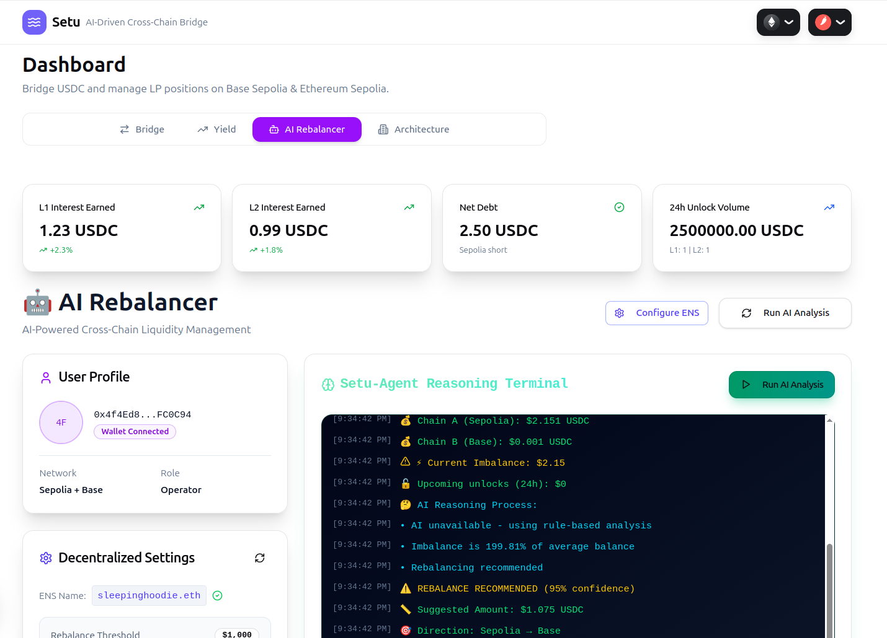
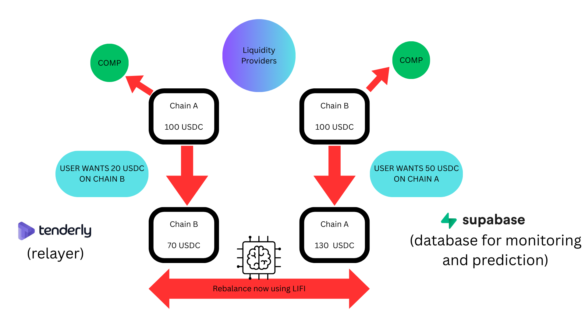

# Hack Money 2026 - Project Setu

**AI-Powered Cross-Chain Liquidity Rebalancer with Zero Slippage**

---

## 📝 Note

In the video demonstration, the MetaMask window was not captured by the recording software due to time constraints before submission, but the system was fully operational.

---

## 📜 Deployed Contracts

### Ethereum Sepolia
- **Contract Address:** `[0x010a712748b9903c90deec684f433bae57a67476]`
- **Explorer:** [View on Routescan](https://testnet.routescan.io/address/0x010a712748B9903c90DeEc684F433BaE57A67476)

### Base Sepolia
- **Contract Address:** `[0x8116cFd461C5AB410131Fd6925e6D394F0065Ee2]`
- **Explorer:** [View on Blockscout](https://base-sepolia.blockscout.com/address/0x8116cFd461C5AB410131Fd6925e6D394F0065Ee2)

---

## 🔗 How Li.Fi is Used in Setu

**[View Code Implementation →](https://github.com/hardik-kansal/Setu/blob/291ec7211f34737750747b1d4f25ec747a8c3807/app/api/lifi-route/route.ts#L2C1-L83)**

Li.Fi serves as the core cross-chain routing engine for Setu's rebalancing mechanism:

- **Smart Route Calculation:** The rebalancing logic calculates the exact net amount that must move between chains.
- **Optimal Path Selection:** Once rebalancing is required, Li.Fi is queried to find the best cross-chain route for that amount.
- **Unified Bridge + Swap:** Li.Fi handles bridge and swap composition in a single flow, reducing slippage and execution risk.
- **Non-Custodial Execution:** Users approve and execute transactions via their wallet, maintaining full custody of their funds.
- **Provider Agnostic:** Ensures efficient, low-cost, and safe cross-chain rebalancing without hard-coding to a single bridge provider.

---

## 🏷️ How ENS is Used in Project

**[View Code Implementation →](https://github.com/hardik-kansal/Setu/blob/bc77195e64a850c96bef854d946a2eae87582367/components/dashboard/ens-config-resolver.tsx#L8-L290)**

ENS powers Setu's dynamic configuration system without requiring contract upgrades:

- **Dynamic Configuration:** Rebalance urgency conditions are stored in the operator's ENS records.
- **Multi-Operator Support:** Additional control data can be stored across multiple operator ENS addresses.
- **Flexible Parameters:** Store yield-optimization logic, chain-specific risk thresholds, and critical chain conditions.
- **Risk Management:** Enables dynamic handling of scenarios like potential bad-debt outflows or liquidity stress on specific chains.
- **Upgrade-Free:** All configuration changes happen off-chain through ENS, eliminating the need for contract upgrades.

---

## 🎯 Project Overview

Setu enables **near-instant cross-chain token bridging** with minimal fees and zero slippage. 

### Key Features:
- **Flexible Deposits:** Liquidity providers (LPs) deposit tokens on any supported chain
- **Time-Locked Security:** Funds are locked for a fixed duration to ensure system stability
- **Yield Generation:** Idle liquidity on each chain is deployed into DeFi protocols to generate high yield
- **Cross-Chain Earnings:** LPs earn interest from both chains, regardless of their initial deposit chain
- **Peer-to-Peer Marketplace:** Users can bridge tokens directly without traditional bridge fees

---

## 🏗️ System Architecture

### How It Works:

1. **Continuous Monitoring:** Liquidity is continuously monitored across all supported chains.
2. **Trigger Evaluation:** When predefined trigger conditions (stored in the operator's ENS address) indicate urgency, the system evaluates rebalancing needs.
3. **AI-Powered Decision:** An AI agent confirms whether rebalancing is required based on current state and predicted liquidity needs.
4. **Optimal Route Discovery:** If rebalancing is needed, Li.Fi determines the most efficient cross-chain route.
5. **Automated Execution:** The rebalancing transaction is executed seamlessly across chains.
6. **Yield Distribution:** LPs earn interest from both chains irrespective of the chain on which they deposited.

**Key Innovation:** Unnecessary bridge transactions are avoided because the system operates as a peer-to-peer marketplace for users, with intentionally simple yet effective AI logic.

---

## 📊 Dashboard Preview

The dashboard provides real-time insights into:
- Current liquidity distribution across chains
- AI-powered rebalancing recommendations
- Historical rebalancing transactions
- LP leaderboard and performance metrics
- Upcoming unlock schedules
- System health and status

---

## 🧮 Rebalancing Logic

The rebalancing algorithm follows these steps:

1. **Historical State:** Fetch the last rebalance state (total assets on each chain, including accrued interest) from Supabase, populated by a Tenderly relayer when on-chain events occur.

2. **Current State:** Fetch the current total assets from the SetuVault contract on both chains.

3. **Future Obligations:** Retrieve the amount LPs can withdraw the next day based on their lock period from Supabase.

4. **Trigger Analysis:** Fetch trigger conditions from the operator's ENS address.

5. **Net Calculation:** Use these inputs to calculate the net rebalancing required to maintain optimal liquidity distribution.

6. **Route Execution:** Query Li.Fi for the optimal cross-chain route and execute the rebalancing transaction.

---

## 🚀 Future Targets

### Short-Term Goals:
- Introduce advanced yield strategies that are continuously monitored to predict the optimal time for rebalancing
- Add different stability criteria managed via multiple operator ENS addresses

### Long-Term Vision:
- Use historical Setu data to train machine learning models that detect urgent or adverse scenarios early and help mitigate risk
- Implement predictive analytics for proactive rebalancing before liquidity crises occur
- Expand Setu to support more chains (Arbitrum, Optimism, Polygon, etc.)
- Add support for more asset types and yield strategies

---

## 📚 Additional Documentation

- **[Setup Guide](SETUP_GUIDE.md)** - Get started in 5 minutes
- **[Tech Stack](TECH_STACK.md)** - Technologies and tools used
- **[Rebalancing Math](REBALANCING_MATH.md)** - Mathematical model explained

---

## 🏆 Hack Money 2026

Built for ETHGlobal's Hack Money 2026 hackathon, showcasing the power of composable DeFi protocols and AI-driven automation.